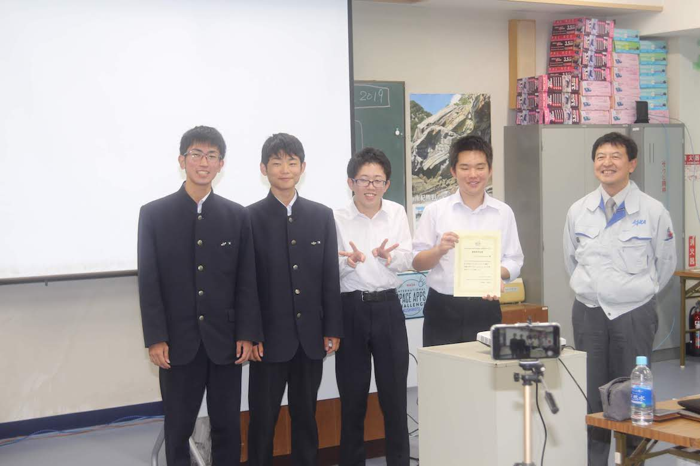
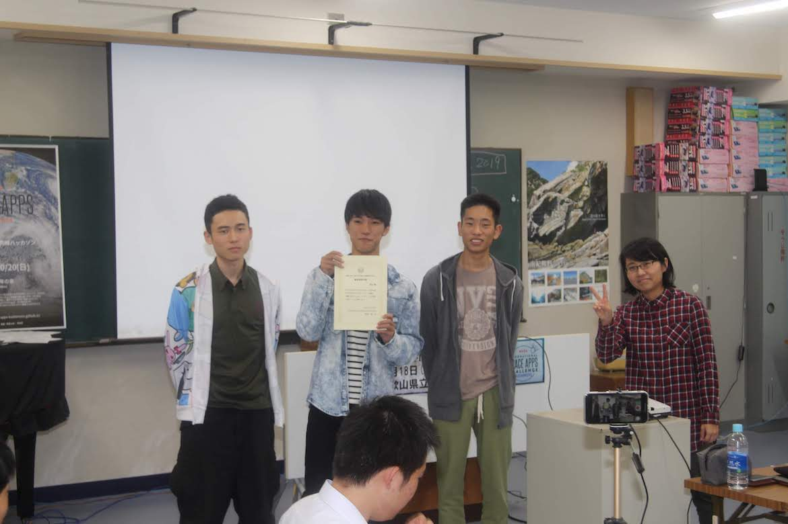
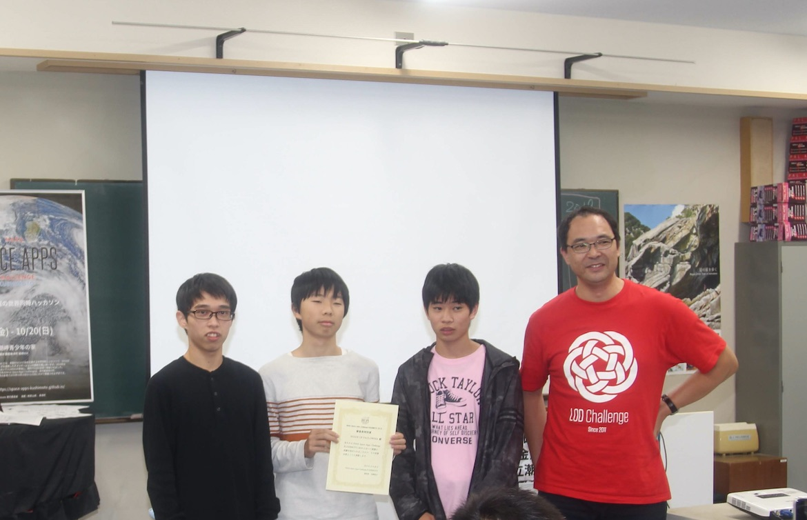
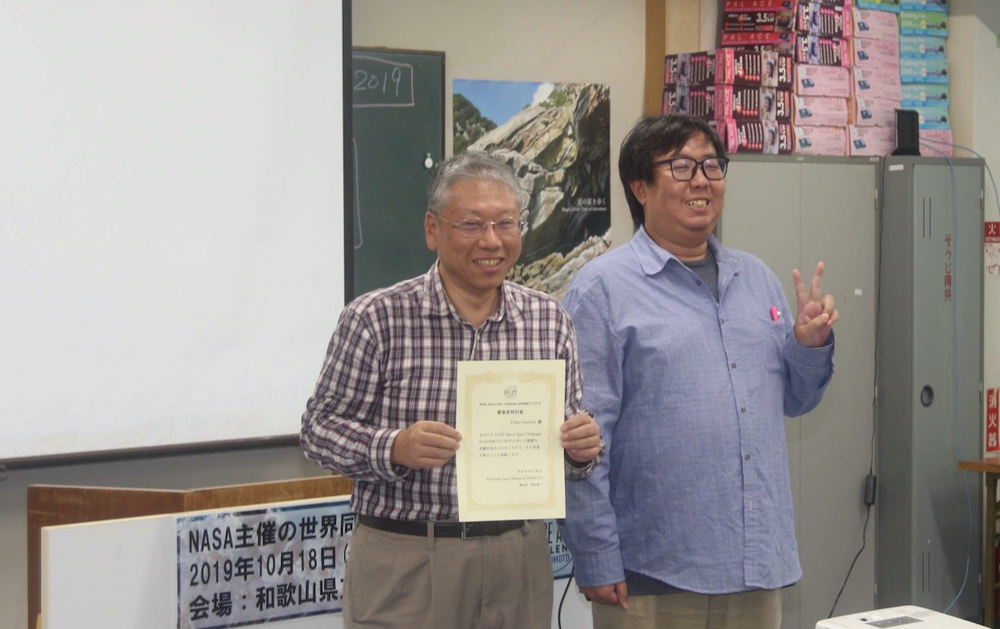

Space Apps Challenge Kushimoto 2019 の受賞チームが決定しました。

## 総合優勝 / グローバルアワードノミネート

<table class="table table-bordered">
<tbody>
<tr><th scope="row">チーム名</th><td>CONSTELLATOR!</td></tr>
<tr><th scope="row">メンバー</th><td>野崎智弘、鎌谷天馬、村馬弘一、三橋優希、西村惟</td></tr>
<tr><th scope="row">タイトル</th><td>CONSTELLATOR!</td></tr>
<tr><th scope="row">内容</th><td>オリジナルの星座を作って投稿・共有できるアプリ。自分で星座を作ることで星が身近になり、星に興味を持ってもらう。</td></tr>
<tr><th>アプリURL</th><td><a href="https://team-mihashi.github.io/CONSTELLATOR/">https://team-mihashi.github.io/CONSTELLATOR/</a></td></tr>
<tr><th scope="row">スライド</th><td><a href="https://speakerdeck.com/yuki384/constellator">https://speakerdeck.com/yuki384/constellator</a></td></tr>
<tr><th scope="row">講評</th><td>
<dl><dt>寺田審査員</dt><dd>星座を構成するのは恒星であり、その上で Build a Planet (惑星を作る)カテゴリーにエントリーするのは、大人にはなかなかできない発想。</dd></dl></td></tr>
</tbody>
</table>

## 審査員賞（寺田 弘慈 審査員）

<table class="table table-bordered">
<tbody>
<tr><th scope="row">チーム名</th><td>Ex_combipesination</td></tr>
<tr><th scope="row">メンバー</th><td>榎本考、阪井大雅、御前賢斗、井上穂大</td></tr>
<tr><th scope="row">内容</th>
<td>過去24時間のブラジルの火災現場をマップに記し特定する。その地点に人工衛星を投下して写真を撮影し解析する。火災発生前と鎮火後の同じ場所の写真を解析し、自然環境の変化や起こりうる被害を推測する。</td>
</tr>
<tr>
<tr><th scope="row">スライド</th><td><a href="https://speakerdeck.com/misaken/spaceapps2019-koyo">https://speakerdeck.com/misaken/spaceapps2019-koyo</a></td>
</tr>
<th scope="row">講評</th>
<td><dl><dt>西村審査員</dt><dd>動機が伝わるプレゼンテーションで良かった。</dd></dl><dl><dt>
寺田審査員</dt><dd>プレゼンテーションが非常に堂々としていて立派だった。こだわりのある缶サットや、それ以外の衛星データなどを使って大きな課題解決をしていきたいという意識を感じられた。</dd></dl></td>
</tr>
</tbody>
</table>

## 審査員賞(牟田 梓 審査員)

<table class="table table-bordered">
<tbody>
<tr><th scope="row">チーム名</th><td>チーム海南</td></tr>
<tr><th scope="row">メンバー</th><td>柿本凱士、古川拓海、山縣広大</td></tr>
<tr><th scope="row">内容</th>
<td>Landsat8の衛星写真、 MapExpert 、Tellus、国土交通省空路データなどを使い、地図の写真を合成することで、缶サットの打ち上げに適した場所を探す。</td>
</tr>
<tr>
<tr><th scope="row">スライド</th><td><a href="https://speakerdeck.com/cansatkainan/fou-satutofalseda-tishang-genishi-sitachang-suo-wotan-sudi-tu-wozuo-ru">https://speakerdeck.com/cansatkainan/fou-satutofalseda-tishang-genishi-sitachang-suo-wotan-sudi-tu-wozuo-ru</a></td>
</tr>
<th scope="row">講評</th>
<td><dl><dt>牟田審査員</dt><dd>課題設定が良かった。自分も学生時代に缶サットをやっていたので、打ち上げ場所がないと言うのはリアルな課題なのが分かった。また、Tellus を使う中で複数のデータを組み合わせて何か知見を得ようとしたと言うアプローチがおもしろく感じられた。</dd></dl></td>
</tr>
</tbody>
</table>

## 審査員賞 (古崎 晃司 審査員)

<table class="table table-bordered">
<tbody>
<tr><th scope="row">チーム名</th><td>SHADE OF PAULOWNIA</td></tr>
<tr><th scope="row">メンバー</th><td>飛田喜紀、稲住大地、内芝謙允</td></tr>
<tr><th scope="row">タイトル</th><td>CanSatOperator (CSO)</td></tr>
<tr><th scope="row">内容</th>
<td>NASA の オープンソースソフトウェア OpenMCT を普段取り組んでいる缶サットに適した形に改造することで、缶サットのための Mission Control Software を開発し、缶サットのオペレーションと成果取りまとめの効率化と高度化を目指す。</td></tr>
<tr><th scope="row">スライド</th><td><a href="https://speakerdeck.com/updjolo/can-sat-operator-by-toin-high-school">https://speakerdeck.com/updjolo/can-sat-operator-by-toin-high-school</a></td></tr>
<tr><th scope="row">講評</th><td><dl><dt>古崎審査員</dt><dd>プログラムをはじめたばかりのところ、巨大なオープンソースプロジェクトと、自分たちのデータを果敢に結びつけたチャレンジ精神を評価した。今後みなさんがこのようなソフトウェアを使っていく中でどんどんよくなっていくことを期待したい。改良したものはぜひオープンソースで公開して欲しい。</dd></dl></td></tr>
</tbody>
</table>

## 審査員賞（西村 竜一 審査員）

<table class="table table-bordered">
<tbody>
<tr><th scope="row">チーム名</th><td>Tellus-Sashimi</td></tr>
<tr><th scope="row">メンバー</th><td>山本三七男</td></tr>
<tr><th scope="row">タイトル</th><td>Tellusで、串本の美味しいお刺身を！</td></tr>
<tr><th scope="row">内容</th><td>
JupitarLab を使って現在地の潮岬の衛星画像を取得し、データを加工して3Dプリンタで醤油皿の判を作成した。陶器用ねんどにスタンプして焼くと衛星画像が浮かび上がる醤油皿ができる。今後はどの地形で作ったお皿で食べる刺身がおいしいのか調べていく。</td></tr>
<tr><th scope="row">スライド</th><td><a href="https://speakerdeck.com/tarosay/tellusde-chuan-ben-falseoisiioci-shen-wo">https://speakerdeck.com/tarosay/tellusde-chuan-ben-falseoisiioci-shen-wo</a></td></tr>
<tr><th scppe="row">講評</th><td><dl><dt>西村審査員</dt><dd>くだらなくも素晴らしい発表で、若い参加者が多い中ハッカソンの見本を見せてくれた。</dd></dl></td></tr>
</tbody>
</table>
